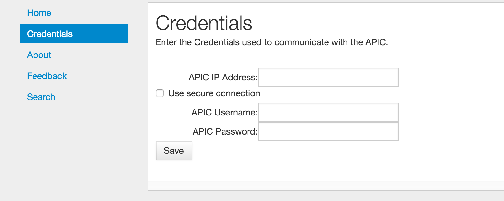
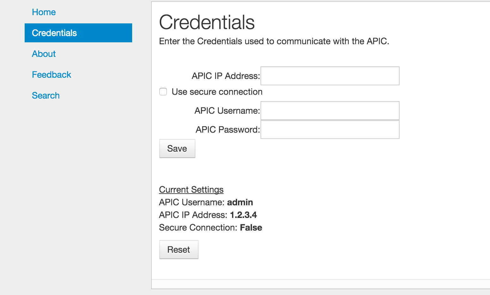
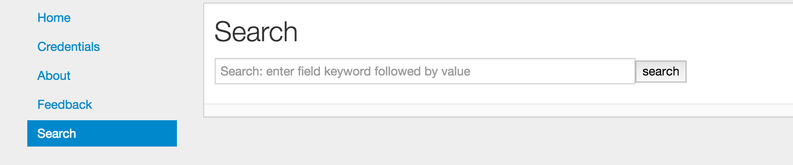
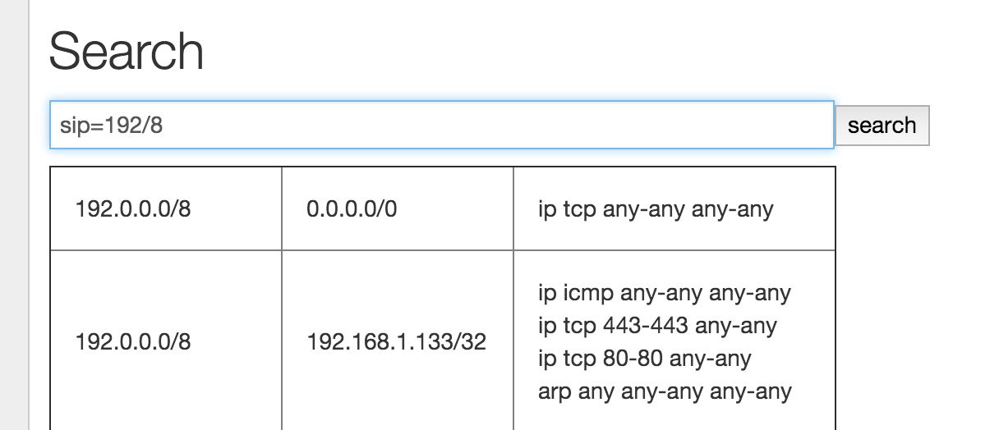
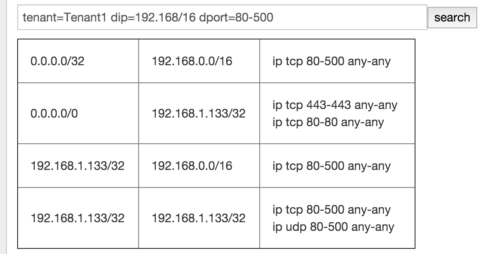
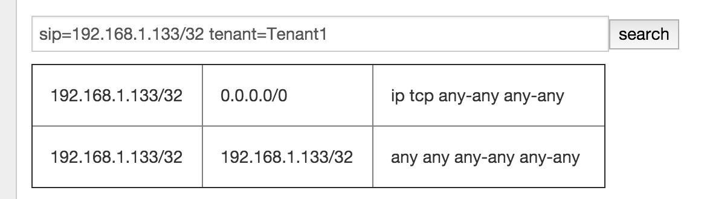

Connection Search : Configured Connection Search Tool
==============================================

| `Summary`_
| `General Overview`_
| `Installation`_
| `Web based Usage`_
|    `Credentials`_
|    `Performing a Search`_
|    `Examples`_
|    `About`_
|    `Feedback`_
| `Command Line Usage`_

Summary
-------
Connection Search is an application that allows the user to search
for connections between endpoints on the ACI fabric.

General Overview
----------------
The Connection Search GUI provides a simple search bar.  The user can
enter a query into this search bar and the results are then displayed.

The results are in the format of a table where set of IP addresses or
subnets in the first column corresponds to connection sources, a set
of IP addresses or subnets in the second column corresponds to
connection destinations, and a final column that shows which filters are
applied to these connections.

Each row of the table is for a unique source-dest combination.

A search query consists of a set of *attribute=value* tuples.  Any attribute
can be used at most one time in a given search.  If an attribute is not
specified, then the search will assume those omitted attributes should
not be used to qualify the results.  For example, if NO attributes are
specified, then ALL connections will be reported.  If *sip=10.11.12/24*
is specified, then only connections that have a source that is covered by
the subnet *10.11.12.0/24* will be reported.

Installation
------------

Connection Search is part of the acitoolkit and will be installed at the same
time.  The installation details can be found `here <tutorialsetup.html#install>`_.

Web based Usage
---------------

Connection Search should be run as a web application. Running Connection
Search as a web
application is done by switching to the connection_search directory and running
the application::

  cd acitoolkit/applications/connection_search
  python aciConSearchGui.py

By default, Connection Search will run locally on the loopback address.
Accessing the tool is done by running a web browser locally and
pointing to the following URL::

  http://127.0.0.1:5001/

Upon pointing the web browser to the Connection Search URL, the Connection Search
welcome screen along with the navigation menu on the left hand side will be displayed.

Credentials
~~~~~~~~~~~

Entering the APIC credentials is necessary for Connection Search to be able to
perform searches. Selecting the Credentials in the
navigation menu will bring up the Credentials screen where the APIC
credentials can be entered.

A number of fields allow the entry of the APIC credentials.  These
fields are:

    **APIC IP Address**:  This field is the IP address used to
    communicate with the APIC.

    **Use secure connection**: When selected, this checkbox indicates
    that the APIC communication uses https instead of http.
    
    **APIC Username**: The username used when logging in to the APIC.

    **APIC Password**: The password used when logging in to the APIC.

The credentials are stored with Connection Search by selecting the **Save**
button. Once the credentials are entered, they will be saved as part
of the user session on that browser.  This means that another window
or tab using Connection Search can be opened on the same machine without having
to re-enter the credentials.

When entered, the current credentials are shown as in the screenshot
below.  Note that for security purposes, the password is not
displayed.  Clicking the **Reset** button will cause Connection Search to
forget the current credentials, but will not impact the APIC in any way.

Performing a Search
~~~~~~~~~~~~~~~~~~~
Selecting **Search** from the navigation menu will bring up the main search screen.
Note that when this item is initially selected the Connection Search application
will read in the configuration of the APIC.  This may take some time depending upon
the size of your configuration as well as the speed of your network connection.
Your browser may indicate that it is "waiting on 127.0.0.1" while the configuration
is loading.  Please be patient.

A search consists of entering the search filter criteria in the search bar and then pressing
the **SEARCH** button.  If no criteria is entered, all connections will be displayed.

The search criteria consists of a set of *attribute=value* tuples separated by spaces.
Each attribute can only be used once.  If it is used more than once, the last one is the
only one that will take effect.

The Attributes are as follows:

    **tenant**: The name of the tenant to conduct the search in.  Note that this will
    be the tenant used for both the source and the destination so it will not find connections
    that are end-points using services shared from a different tenant.  A search that does not
    specify the tenant should be used when looking for these kinds of connections.

    The tenant name can also contain a simple "*" as a wild-card.  For example, *tenant=foo**  will
    match on tenants with the name *foo*, *foobar*, and *foo_xyz*.  *tenant=foo\*bar* will match
    on tenants with the name *foobar* and *foohellobar*, but not *foobar5*.

    **context**: The name of the context to conduct the search in.  Like the *tenant* attribute,
    this one will apply to both the source and destination and can contain wild-cards.  The *context*
    attribute would typically be used in conjunction with the *tenant* attribute, but that is not
    required.

    **contract**: The name of a contract can be specified and only connections that use contract(s) with that
    name will be selected.  Note that the contact name cannot be further qualified with the tenant name.  However,
    the tenant name can be one of the attributes, but that will limit the result to only endpoints that are
    under that tenant.

    **sip**: The source IP address or source subnet.  When entering an address, it should be in the defacto
    standard form of *a.b.c.d*.  For example, 10.2.5.8.  When entering a subnet, it should take the form
    of *a.b.c.d/s* where "s" is the length of the subnet mask.  Any of the prefix digits that are omitted are
    assumed to be zero.  For example, *192/8* is equivalent to *192.0.0.0/8* and *192/16* is equivalent to
    *192.0.0.0/16*.  The *sip* attribute does not accept the "*" wild-card.

    Note that when doing a search where the matching criteria can be either more or less specific than the
    field in the policy, the result displayed with be value in the policy.  For example, if a search is done for
    *sip=1.2.3.0/24* and there is a L3Out that has the address *1.2/16* that matches that *sip*, the output
    result will show *1.2/16*.  Similarly, if there is an EPG with addresses *1.2.3.4/32* and *1.2.3.89/32*,
    the result displayed in the source column will be *1.2.3.4/32* and *1.2.3.89/32*.

    **dip**: The destination IP address or destination subnet.  See **sip** above for how this attribute works.

    **dport**: The layer 4 destination port or port range.  This attribute implies that the *prot* field is *tcp*
    *udp* and the *etherT* field is *ip* unless otherwise specified.  The format is either a single value or a range.
    When entering a range, the minimum value should be separated from the maximum value by a dash "-".  For example,
    *dport=80* or *dport=20-45*.  A limited set of common protocol acronyms can also be used.  The currently
    supported set is:
            'http', 'https', 'ftp-data', 'smtp', 'dns', 'pop3', 'rtsp', and 'any'

    **sport**: The layer 4 source port or port range.  This attribute works just like the *dport* attribute above.

    **prot**: The layer 4 protocol type.  This attributes allows the user to select which protocol to search for.
    Possible values are:'icmp', 'igmp', 'tcp', 'egp', 'igp', 'udp', 'icmpv6', 'eigrp', 'ospfigp', 'pim',
    'l2tp' and 'any'.

    If the *prot* attribute is specified, then the *etherT* attribute is assumed to be *ip* unless otherwise
    specified.  If the *prot* attribute is specified as *any*, then the *etherT* is not assumed.  Note, that there
    is really no reason to specify *prot=any* as this is the default anyway.

    **etherT**: The Ethertype of the protocol.  Typical values for the *etherT* attribute are *ip* or *arp*.  Specific
    numeric values can also be used, however they will be matched against the actual string value provided by the APIC
    filterEntry object, so a value of *800* will not match *ip*.

    The *etherT* field is assumed to be *ip* if the
    *prot* field is specified to be an IP protocol.  It is assumed to be *arp* if the *arpOpc* attribute is specified.

    **arpOpc**: The ARP opcode.  Possible values are *req*, *reply* and *any*.  The default is *any*.  When the *arpOpc*
    is specifed, the *etherT* is assumed to be *arp*.

    **applyToFrag**:  Apply to fragments attribute.  Possible values are *yes*, *no* and *any*.  The default is *any*.

    **tcpRules**: TCP rules.  This allows the user to specify the TCP rules to match.  Use of this field
    in Connection Search has not been fully validated
    and so should be used with caution (it will do no harm so you may play around with it, just be aware
    the results may not be what you expect).  It must be entered exacty the way the APIC specifies it the
    FilterEntry object.  If *tcpRules* are specified, then the *prot* attribute is assumed to be *tcp*.

When the search results are displayed, placing the cursor over a table cell will cause a fully qualified name of the
EPG or OutsideEPG to be displayed and the contract.

For communication within an EPG, i.e. between two end-points that are in the same EPG, Connection Search will create an
"implied" contract that is both provided and consumed by that EPG.  The filter in that contract will allow all
communication.  When the cursor hovers over the filter cell for such a connection, the contract name will begin with
"implied" followed by a number that makes it unique.  This contract does not actually exist in the APIC.

Examples
~~~~~~~~
The following are a few examples of searches and explanation of the results.

Example 1
^^^^^^^^^
Find all the connections whose source IP address is in the subnet "192.0.0.0/8".

Here we see how the search is contructed, ``sip=192/8``.  This tells the application to find all connections whose
source IP address has the first 8-bits equal to "192".

The results show three connections.  The first shows traffic from ``0.0.0.0/0`` to ``0.0.0.0/0``.  This shows that all
traffic from the ``mgmt`` tenant can be switched to ``Tenant1`` ``L3Out-FW-outside`` as long as it is ``TCP`` traffic.
It has a filter of ``ip tcp any-any any-any both`` which should be
interpreted as:

* EtherType = IP
* IP protocol = TCP
* L4 destination port minimum = any
* L4 destination port maximum = any
* L4 source port minimum = any
* L4 source port maximum = any
* Direction with respect to destination = both

The following two rows show connections from ``Tenant1`` to ``Tenant1``, i.e. they correspond to different traffic
than the first row.

Note that there were additional results that are not shown in the above image.

Example 2
^^^^^^^^^
This next example shows a search looking for traffic in a tenant named "Tenant1", whose destination is to anything
in the ``192.168.0.0/16`` subnet on any layer 4 destination port number in the range of ``80`` to ``500``.

The results show 3 connection groups.  The first one is from a host IP of ``0.0.0.0/32``.  This looks funny and is
probably a configuration error in the APIC.  The destination here is ``0.0.0.0/0`` and the filter is for any
TCP traffic. ``0.0.0.0/0`` in the destination column covers the search criteria of ``dip=192.168.0.0/16``,
and the filter of any-any for the destination port range covers the search criteria of ``dport=80-500``.

Example 3
^^^^^^^^^
In this query, the user wants to see all of the destinations that host ``192.168.1.133`` in tenant "Tenant1"
can send traffic to.

Here there are two results.  The first shows that this host can send traffic to default route of ``0/0`` for any TCP
traffic.  The second row shows that this host can communicate with itself using any protocol.  This second one
has a fully open filter of ``any any any-any any-any both``.  When we place the cursor over this row we can see that
this was an "implied" filter.  The implied filter is created by the connection search tool to show that end-points
within an EPG can communicate with each other without any constraint.

About
~~~~~

This is a simple summary screen with a link to the documentation and a
description of the software license.

Feedback
~~~~~~~~

This screen provides the ability for the users to submit comments,
suggestions, feature requests, and bug reports directly to the authors
of the tool.

Command Line Usage
------------------

Connection Search can also be run as a command line application. This is done
by switching to the Connection Search directory and running the application::

  cd acitoolkit/applications/connection_search

The application is run with options provided in the command line.  The
help for this command is shown by::
 
  python aciConSearch.py --help

The output for this command is shown below::

    usage: aciConSearch.py [-h] [-u URL] [-l LOGIN] [-p PASSWORD]
                           [--snapshotfiles SNAPSHOTFILES [SNAPSHOTFILES ...]]
                           [-tenant TENANT] [-context CONTEXT] [-sip SIP]
                           [-dip DIP] [-dport DPORT] [-sport SPORT]
                           [-etherT ETHERT] [-prot PROT] [-arpOpc ARPOPC]
                           [-applyToFrag APPLYTOFRAG] [-tcpRules TCPRULES]

    Connection Search tool for APIC.

    optional arguments:
      -h, --help            show this help message and exit
      -u URL, --url URL     APIC IP address.
      -l LOGIN, --login LOGIN
                            APIC login ID.
      -p PASSWORD, --password PASSWORD
                            APIC login password.
      --snapshotfiles SNAPSHOTFILES [SNAPSHOTFILES ...]
                            APIC configuration files
      -tenant TENANT        Tenant name (wildcards, "*", accepted), default "*"
      -context CONTEXT      Context name (wildcards, "*", accepted), default "*"
      -sip SIP              Source IP or subnet - e.g. 1.2.3.4/24, default: "0/0"
      -dip DIP              Destination IP or subnet - e.g. 1.2.3.4/24, default:
                            "0/0"
      -dport DPORT          Destination L4 Port value or range, e.g. 20-25 or 80.
                            Default: "any"
      -sport SPORT          Source L4 Port value or range, e.g. 20-25 or 80.
                            Default: "any"
      -etherT ETHERT        EtherType, e.g. "ip", "arp", "icmp". Default: "any"
      -prot PROT            Protocol, e.g. "tcp", "udp". Default: "any"
      -arpOpc ARPOPC        ARP Opcode, e.g. "req", "ack". Default: "any"
      -applyToFrag APPLYTOFRAG
                            Apply to fragment, e.g. "yes", "no". Default: "any"
      -tcpRules TCPRULES    TCP rules, e.g. "syn", "fin". Default: "any"

The APIC credentials are provided with the *--url*, *--login*, and
*--password* options.

The remaining fields follow the attributes described above for the GUI version of the tool.
Note that when aciConSearch.py is used from the command line in this manner, the APIC
configuration will be loaded and a single search conducted.  When the GUI version is used,
the APIC configuration is loaded and multiple searches can be made against it without doing
a re-load.

