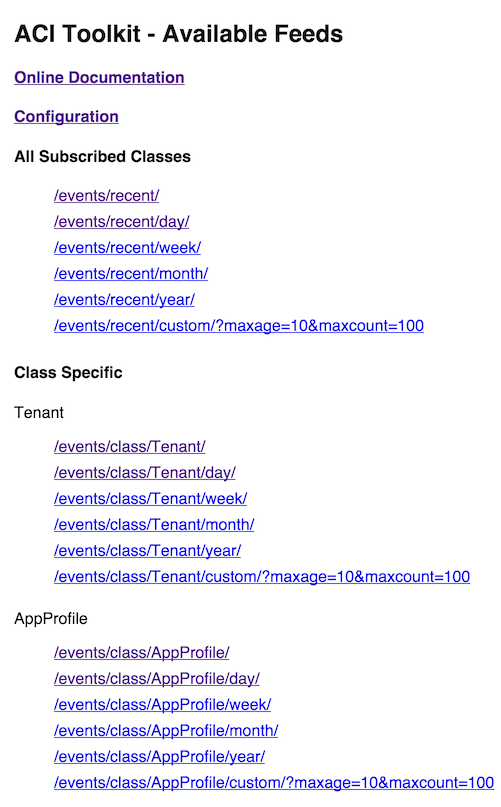
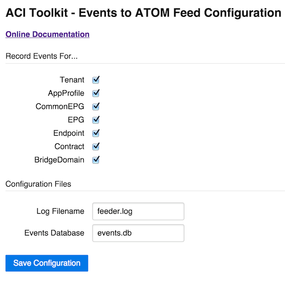

EventFeeds: ACI Events to Atom Feed
===================================

The EventFeeds application subscribes to
APIC Managed Objects and records any updates to the
objects over a websocket connection. These updates can be
viewed in a variety of Atom Feeds provided over HTTP.

Some sample use cases for the ACI Events to Atom Feed app:

* Display recent endpoints in a NOC
* Display updated tenants on an IPTV
* Monitor EPG changes in a feed client

Installation
------------

acitoolkit
~~~~~~~~~~
This application uses the acitoolkit.  The installation steps for the
acitoolkit can be found at `<http://datacenter.github.io/acitoolkit/>`_.

Flask
~~~~~
Flask is required.  Flask should be installed automatically as a
dependency of acitoolkit. If not the installation steps for
Flask can be found at `<http://flask.pocoo.org/>`_.

Usage
-----

1. **Command Line Arguments**

   The login credentials can be passed directly as command line
   arguments.  The command is shown below::

     python eventfeeds.py --help
     usage: eventfeeds.py [-h] [-u URL] [-l LOGIN] [-p PASSWORD]
                 [--snapshotfiles SNAPSHOTFILES [SNAPSHOTFILES ...]] [--ip IP]
                 [--port PORT] [--test]

   where the parameters are as follows:
   
   +----------------+------------------------------------------------+
   +URL             | The URL used to communicate with the APIC.     |
   +----------------+------------------------------------------------+
   +LOGIN           | The username used to login to the APIC.        |
   +----------------+------------------------------------------------+
   +PASSWORD        | The password used to login to the APIC.        |
   +----------------+------------------------------------------------+
   +IP              | The IP address the webserver should bind to    |
   +----------------+------------------------------------------------+
   +PORT            | The PORT the webserver should bind to          |
   +----------------+------------------------------------------------+

   An example would be the following::

     python eventfeeds.py -u https://172.35.200.100 -l
     admin -p apicpassword --ip 127.0.0.1 --port 5000
  
2. **Configuration**

    The application can be configured via the GUI at ``http://[ip]:[port]/config/``

    Under **Record Events For...** select the classes that you would like the
    app to monitor.

    **Only select the classes that you are interested in to save
    on network and database usage.**

    **Log Filename** and **Events Database** can be used to set where the log files
    are saved to and where the sqlite3 event database will be stored. The path is
    relative to the working directory of the app.

    Clicking **Save Configuration** will write out the configuration to `config.json`

    You **must** restart the process for the changes to take effect.

What's it doing ?
-----------------

Once the application is running, it will connect to the APIC and subscribes
(over a websocket) to any requested classes in the configuration file.

Whenever an update is received a row is inserted into a local database
table named ``events``. Each row has the Class Name, Name, Timestamp, and
JSON representation of the object.

When you request a feed the Flask web application will query the database
for the relevant events and then dynamically generate an Atom compatable feed.

Note that updates to the database will only occur when the ACI
Events to Atom Feed is running.

Feed Details
------------

The feed produced by this application is compatable with the `Atom Syndication Format
standard <https://en.wikipedia.org/wiki/Atom_(standard)>`_

Each feed entry consists of the following fields::

  <entry xml:base="http://[ip]:[port]/events/class/[Class]/[Filter]/">
    <title type="text">[Class]</title>
    <id>[Name]</id>
    <updated>[Timestamp]</updated>
    <author>
      <name>APIC</name>
    </author>
    <content type="text">[JSON]</content>
  </entry>

.. note:: The JSON body will have the following characters escaped " ' < > &

Screenshots
-----------

Head to the root of the application to get a list of available feeds
e.g. `http://127.0.0.1:5000/`

Configuration is available at the /config/ URL e.g. `http://127.0.0.1:5000/config/`

License
-------
Copyright 2015 Cisco Systems, Inc.

   Licensed under the Apache License, Version 2.0 (the "License");
   you may not use this file except in compliance with the License.
   You may obtain a copy of the License at

       http://www.apache.org/licenses/LICENSE-2.0

   Unless required by applicable law or agreed to in writing, software
   distributed under the License is distributed on an "AS IS" BASIS,
   WITHOUT WARRANTIES OR CONDITIONS OF ANY KIND, either express or implied.
   See the License for the specific language governing permissions and
   limitations under the License.
