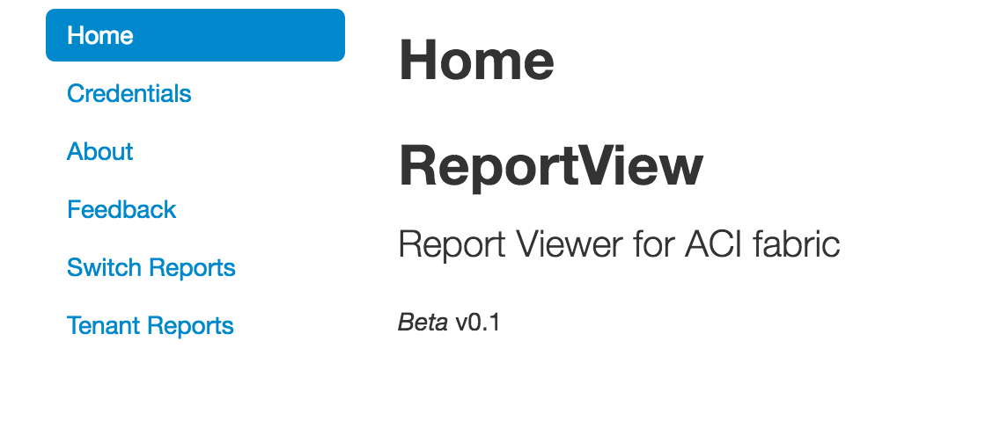
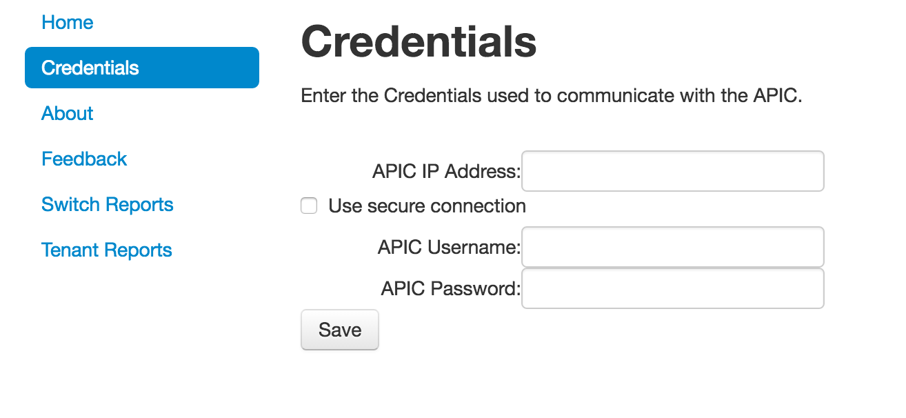
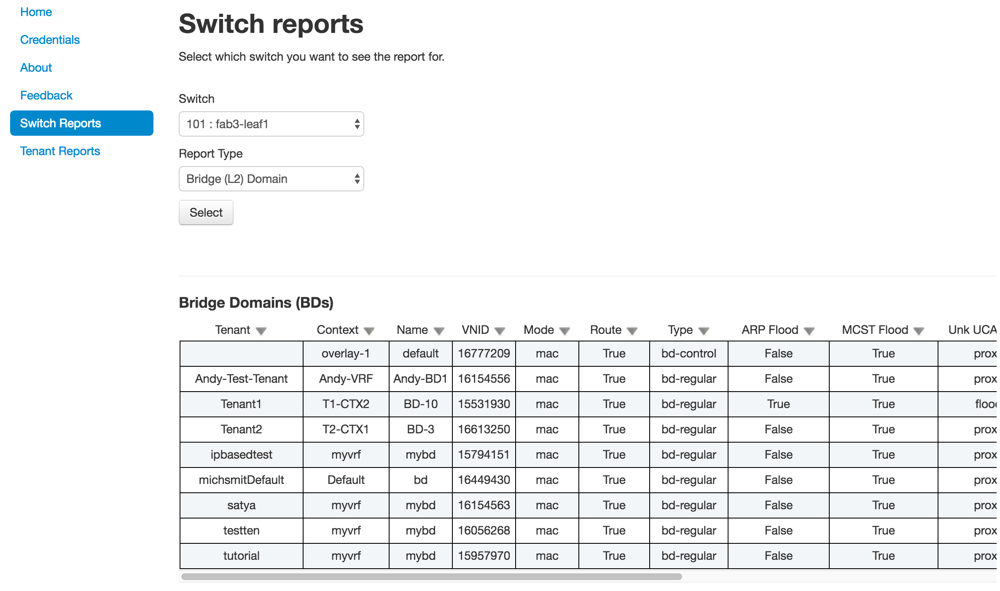
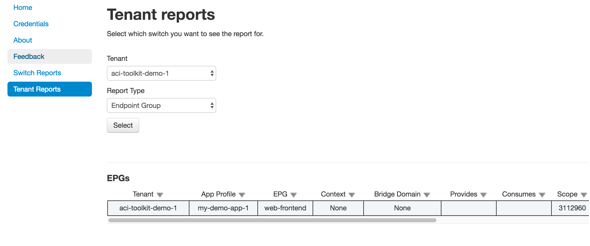

ACI ReportView GUI
==================

Reports can be generated using a GUI based application. Switch reports or Tenant reports can be
generated using this application.

Installation
------------

This reporting application is included in the ``acitoolkit`` package when downloaded using the ``git clone`` method
of installation. The application can be found in the ``acitoolkit/applications/reports`` directory.

Usage
-----

The application is started from the command line.  In its simplest form, it can be invoked by the following command::

  python aciReportGui.py

The full command help is shown below::

  python aciReportGui.py -h
  usage: aciReportGui.py [-h] [--ip IP] [--port PORT] [--test]
                       [--debug [{verbose,warnings}]]

  ACI Report Viewer Tool.

  optional arguments:
    -h, --help            show this help message and exit
    --ip IP               IP address to listen on.
    --port PORT           Port number to listen on.
    --test                Enable functions for lab testing.
    --debug [{verbose,warnings}]
                          Enable debug messages.

By default, the reporting application runs on port ``5000``. This port can be changed by passing the ``--port`` command
line option.

By default, the IP address used is the ``127.0.0.1`` loopback address. This allows the application
to be accessed locally. If the application needs to be accessed from web browsers on different machines, it should be
run on the actual IP address of the local machine. This can be specified using the ``--ip`` command line option.

Once invoked, the GUI is displayed by connecting to ``http://127.0.0.1:5000`` (assuming that the IP and Port are using
the default values).

Credentials
~~~~~~~~~~~

Before the application can generate reports, the application needs to have the credentials required to login to the
APIC.  This is done by selecting the ``Credentials`` menu item in the main ReportsView application.

Selecting the ``Credentials`` menu item will display the following form for entering credentials.

The IP address, username, and password of the desired APIC are entered. If the APIC requires HTTPS, the ``Use secure
connection`` checkbox should be selected.

Once the credentials have been entered and the ``Save`` button is cliecked, the credentials will be displayed as having
been set.

.. image:: saved-credentials.png

The credentials can be purged by clicking on the ``Reset`` button.

Switch Reports
~~~~~~~~~~~~~~

Once credentials have been entered, the switch reports can be displayed by selecting the ``Switch Reports`` menu
option. Depending on the size of the ACI fabric, it may take a few seconds for the switch reports to load.

The switch report screen contains a pulldown menu to select the individual switch to provide a report.

There are a number of report types that are available. These are selected by using the ``Report Type`` pulldown menu.
The available report types are:

* Basic
* Supervisor Card
* Linecard
* Power Supply
* Fan Tray
* Overlay
* Context
* Bridge (L2) Domain
* Endpoint
* SVI (Router Interface)
* Access Rule
* ARP
* Port Channel (incl. VPC)

Tenant Reports
~~~~~~~~~~~~~~

Once credentials have been entered, the tenant reports can be displayed by selecting the ``Tenant Reports`` menu
option. Depending on the size of the ACI fabric, it may take a few seconds for the tenant reports to load.

The tenant report screen contains a pulldown menu to select the individual tenant to provide a report.

There are a number of report types that are available. These are selected by using the ``Report Type`` pulldown menu.
The available report types are:

* Context
* Bridge Domain
* Contract
* Taboo
* Filter
* Application Profile
* Endpoint Group
* Endpoint

