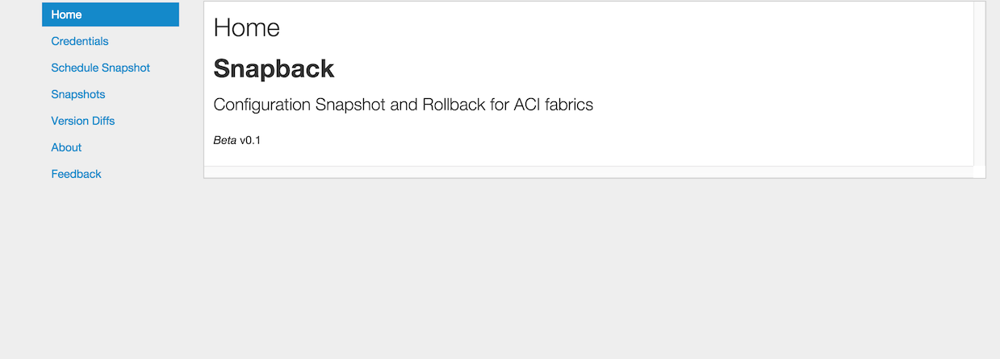
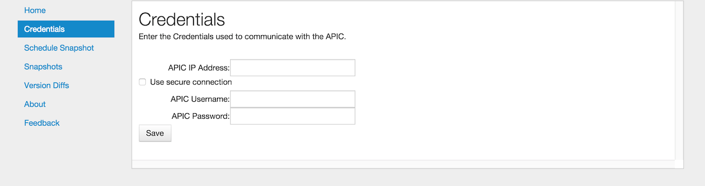
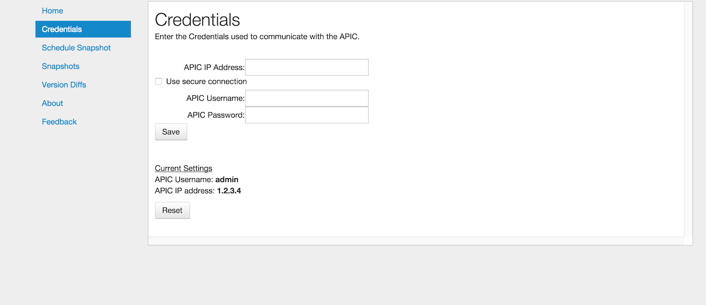
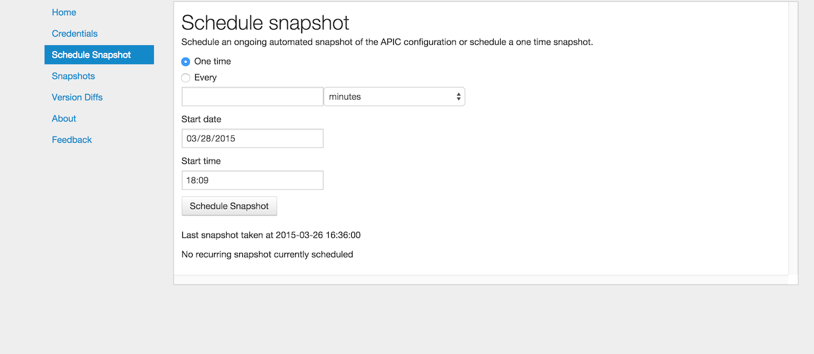
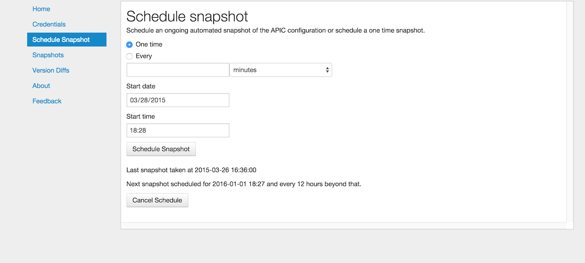
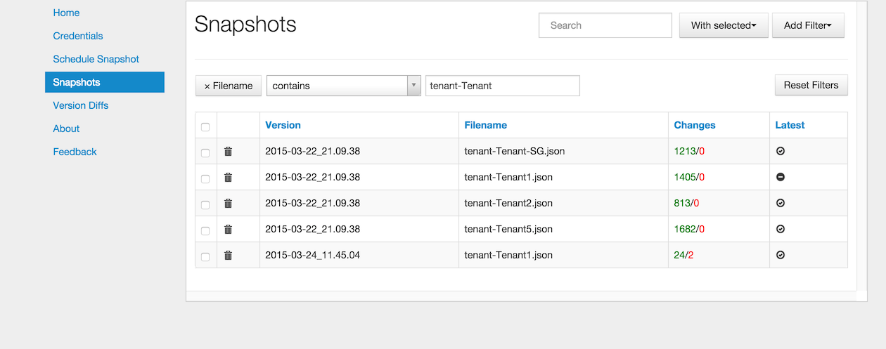
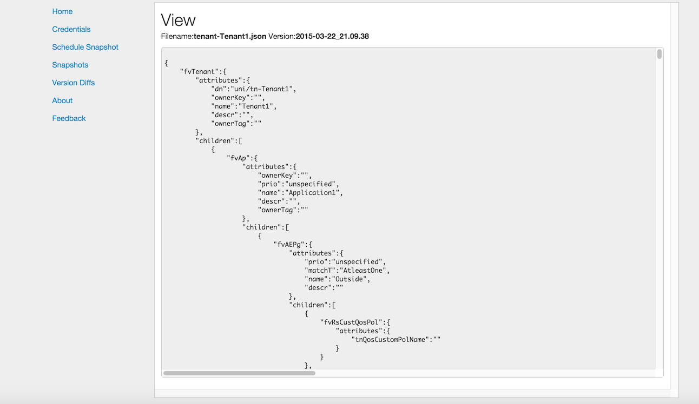
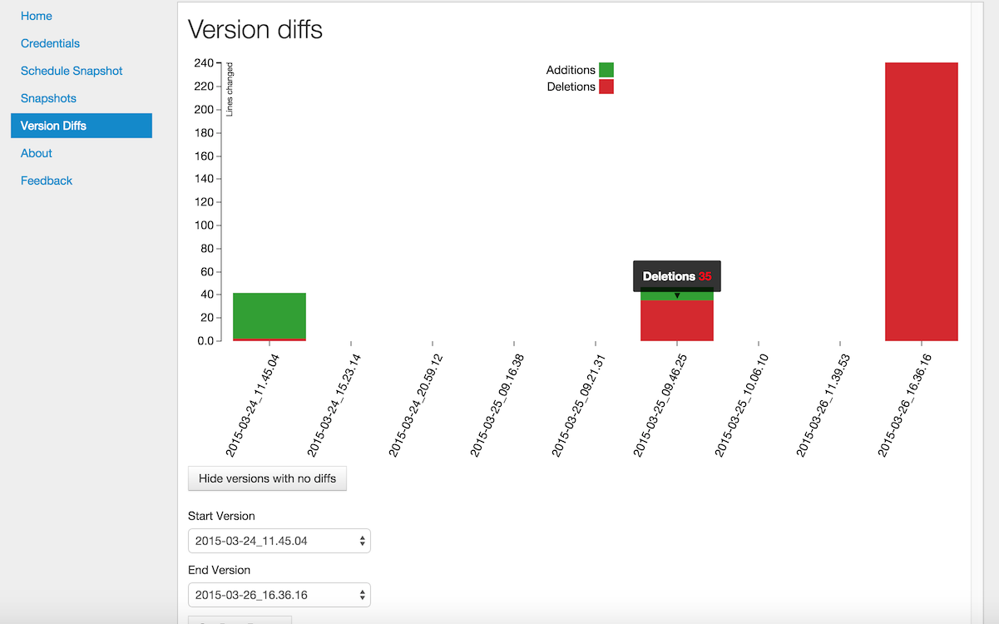

Snapback : Configuration Snapshot and Rollback
==============================================

| `Summary`_
| `General Overview`_
| `Installation`_
| `Web based Usage`_
|    `Credentials`_
|    `Schedule Snapshots`_
|    `Snapshots`_
|    `Version Diffs`_
|    `About`_
|    `Feedback`_
| `Command Line Usage`_
| `Version Repository`_

Summary
-------
Snapback is a Configuration Snapshot and Rollback tool for ACI
fabrics. Specifically, the tool allows an administrator to perform the
following tasks:

* Live snapshots of the running ACI fabric configuration
* One-time and recurring snapshots, both immediate and scheduled
* Versioned storage of the configuration
* Full viewing of any snapshot configuration including the differences between snapshots
* Rollback to any previous configuration snapshot; Full or Partial
* Web based or Command Line administration

General Overview
----------------

Snapback provides the ability to generate configuration snapshots of
the APIC configuration.

Snapshot Files
~~~~~~~~~~~~~~

The configuration snapshots consist of text files containing the
system configuration at the time of the snapshot stored in JSON
format. Each snapshot is stored in a versioned repository along with a
version identifier. The version identifier is automatically generated
by concatenating the date with the time of the snapshot.

A single configuration snapshot contains a number of files. All of the
configuration under the managed object called fabric is placed in the
file ``fabric.json``.  Similarly, all of the configuration under the
managed object called infra is placed in the file ``infra.json``.
Each tenant has their own configuration file with the file name
formatted as ``tenant-<tenantname>.json`` where ``<tenantname>`` is
replaced with the actual name of the tenant.

Each snapshot will only record the differences between the previous
snapshot and the current APIC configuration at the time of the
snapshot. This ensures that the minimal amount of state is stored on
disk to represent the actual configuration.  This also means that even
though a snapshot make occur, it may not create a new version of every
configuration file.  In fact, if there have been no changes at all
since the previous snapshot, no new files will be created.

Rollback
~~~~~~~~

Rollback is when a previous configuration snapshot is used to replace
the current APIC configuration.  This can be done on the granularity
of a snapshot file.  This means that a single tenant can be moved back
to a previous configuration while the other tenants keep their current
configuration state.  This is often referred to as partial rollback.
When all of the configuration files for a particular version are used
to replace the current APIC configuration, this is referred to as a
full rollback.

Installation
------------

Snapback is part of the acitoolkit and will be installed at the same
time.  The installation details can be found `here <tutorialsetup.html#install>`_.

Web based Usage
---------------

Snapback can be run as a web application. Running Snapback as a web
application is done by switching to the snapback directory and running
the application::

  cd acitoolkit/applications/snapback
  python snapback.py

By default, snapback will run locally on the loopback address.
Accessing the tool is done by running a web browser locally and
pointing to the following URL::

  http://127.0.0.1:5000/

Upon pointing the web browser to the Snapback URL, the Snapback
welcome screen along with the navigation menu on the left hand side.

Credentials
~~~~~~~~~~~

Entering the APIC credentials is necessary for Snapback to be able to
perform configuration snapshots. Selecting the Credentials in the
navigation menu will bring up the Credentials screen where the APIC
credentials can be entered.

A number of fields allow the entry of the APIC credentials.  These
fields are:

    **APIC IP Address**:  This field is the IP address used to
    communicate with the APIC.

    **Use secure connection**: When selected, this checkbox indicates
    that the APIC communication uses https instead of http.
    
    **APIC Username**: The username used when logging in to the APIC.

    **APIC Password**: The password used when logging in to the APIC.

The credentials are stored with Snapback by selecting the Save
button. Once the credentials are entered, they will be saved as part
of the user session on that browser.  This means that another window
or tab using Snapback can be opened on the same machine without having
to reenter the credentials.

When entered, the current credentials are shown as in the screenshot
below.  Note that for security purposes, the password is not
displayed.  Clicking the **Reset** button will cause Snapback to
forget the current credentials, but will not impact the APIC in any way.

Schedule Snapshots
~~~~~~~~~~~~~~~~~~

Once the credentials have been entered, configuration snapshots can be
taken.  Snapshots are configured by setting a snapshot schedule. By
selecting the Schedule Snapshots in the navigation menu, the following
screen will appear.

The snapshot can be a one time occurrence or recurring. The *Start
date* and *Start time* fields will be used as the date and time that
will be used to create the snapshot.  If the time has passed, the
snapshot will be triggered immediately.

Selecting the radio button labeled *One time*  will schedule a single
configuration snapshot.

Selecting the radio button labeled *Every*  will schedule a recurring
configuration snapshot starting at the specified *Start date* and
*Start time*.  Immediately below the *Every* radio button is the field
to enter the time interval for the snapshot.  This is entered as a
numeric value within the text box and selecting the granularity of the
interval from the drop down box.  The granularity options are
*minutes*, *hours*, or *days*.

Selecting the *Schedule Snapshot* button will cause the schedule to be
submitted to Snapback.  Below the *Schedule Snapshot* button, the last
successful snapshot time is shown.

Once a configuration snapshot has been scheduled, the option to cancel
the current snapshot schedule is shown as in the screenshot below.

Snapshots
~~~~~~~~~

Selecting *Snapshots* in the navigation window will bring up the
following screen.

The existing snapshots will be shown in a table format.  Each row in
the table represents a snapshot file.  The columns consist of the
following:

    **Version**: This is the timestamp of the configuration file.  The
    format is YY-MM-DD_HH:MM:SS

    **Filename**: The name of the configuration file as described in
    section `Snapshot Files`_.
    
    **Changes**: The Changes column gives the number of lines that
    have changed in this version as compared to the previous
    version. The changes are represented as *additions*/*deletions*.
    The additions are shown in green text and the deletions are shown
    in red text.
    
    **Latest**: This column shows whether the configuration file is
    the most recent version of configuration.  A checkmark indicates
    that this file is the latest.  Since a configuration snapshot file
    is only created when there are changes in the configuration, the
    latest version of different configuration filenames may be
    different.
    
Each of the columns can be sorted by clicking on the column title.

The *Search* text box can be used to filter the table rows shown to
the text entered into the box.  The filter matching will be performed
on the data contained within the Version and Filename columns.

Filters can be added by selecting the *Add Filter* pulldown menu in
the top right corner of the screen.  Filters can be added for the
Version, Filename, and/or Latest columns.

Each row has a checkbox as the leftmost column.  Rows can be selected
individually or all rows can be selected by checking the checkbox in
the column title row.  Rows that have been selected can be subject to
the actions contained within the *With Selected* pulldown menu.  The
following options are available within as *With Selected* options:

* Rollback
    Selecting *Rollback* will cause the selected configuration snapshot
    files to be pushed to the APIC overwriting the current existing
    configuration.  Since this can be a disruptive operation, a
    confirmation dialog box will appear to confirm the user's intent.
    
* View
    Selecting *View* will open the selected files in a separate screen
    showing the entire JSON configuration.

* View Diffs
    Selecting *View Diffs* requires 2 and only 2 files to be
    selected.  In this view, the 2 files are opened in a new screen
    and shown side-by-side.  The 2 files should be of the same file
    name but different versions.

    .. image:: snapback-snapshots-diffview1.png

    File differences are shown highlighted in green for additions, red
    for deletions, and yellow for small intra-line changes.  The
    left-most column allows quick navigation between the changes by
    clicking on the letter within the column.  The letter *f* moves to
    the first change.  The letter *n* moves to the next change.  The
    last change will be marked with the letter *t* which when clicked
    will move to the first change in the file.

    .. image:: snapback-snapshots-diffview2.png

Version Diffs
~~~~~~~~~~~~~

Selecting *Version Diffs* in the navigation will show a visual
representation of the differences between the various versions of
configuration snapshots.

Within this view, the number of lines changed per version are shown as
a stacked bar chart with *Additions* marked as green and *Deletions*
marked as red.

Since many configuration snapshots may not contain any changes, there
is a button that can be selected to hide or show the versions that
have no changes.

Since there may be huge change differences between different
configuration versions, it may be useful to narrow the graph to a
specific date range.  For instance, the very first snapshot will
likely have a large number of additions which may visually hide the
subsequent changes due to scale.  By adjusting the date range, the
initial snapshot can be removed from the bar chart.

Hovering the mouse pointer over the bar will show the actual value.

The value is the cumulative changes from all snapshot files within
that version.  Clicking on the bar will open up the *Snapshots* view
with only the files from that configuration version.  In the
*Snapshots* view, the changes are shown on per configuration file.

About
~~~~~

This is a simple summary screen with a link to the documentation and a
description of the software license.

Feedback
~~~~~~~~

This screen provides the ability for the users to submit comments,
suggestions, feature requests, and bug reports directly to the authors
of the tool.

Command Line Usage
------------------

Snapback can also be run as a command line application. This is done
by switching to the snapback directory and running the application::

  cd acitoolkit/applications/snapback

The application is run with options provided in the command line.  The
help for this command is shown by::
 
  python aciconfigdb.py --help

The output for this command is shown below::

  usage: aciconfigdb.py [-h] [-u URL] [-l LOGIN] [-p PASSWORD]
                      [-s | -ls | -lc [VERSION [VERSION ...]] | --rollback
                      VERSION [CONFIGFILE ...] | --show VERSION CONFIGFILE]

  Configuration Snapshot and Rollback tool for APIC.

  optional arguments:
    -h, --help            show this help message and exit
    -u URL, --url URL     APIC IP address.
    -l LOGIN, --login LOGIN
                          APIC login ID.
    -p PASSWORD, --password PASSWORD
                          APIC login password.
    -s, --snapshot        Take a snapshot of the APIC configuration
    -ls, --list-snapshots
                          List all of the available snapshots
    -lc [VERSION [VERSION ...]], --list-configfiles [VERSION [VERSION ...]]
                          List all of the available configuration files.
    --rollback VERSION [CONFIGFILE ...]
                          Rollback the configuration to the specified version.
                          Optionally only for certain configuration files.
    --show VERSION CONFIGFILE
                          Show the contents of a particular configfile from a
                          particular snapshot version.

The APIC credentials are provided with the *--url*, *--login*, and
*--password* options.

An immediate snapshot is taken by passing the *--snapshot* option.

All of the snapshot versions can be shown by passing the
*--list-snapshots* option.

All of the snapshot files can be listed by passing the
*--list-configfiles* option.  If the optional version is passed, the
files from those versions will be listed.  If no version is passed,
the files from the most recent configuration snapshot will be listed.

Configuration snapshot files can be used to rollback the running APIC
configuration by issuing the *--rollback* option.  This can be issued
for all snapshot files in the version or if the optional list of
configuration files is given, the rollback will only occur for the
specified files.

The file *aciconfigdb.py* serves a dual purpose. It is both a
standalone tool and provides the back end to the GUI.  It can be
imported as a library and used in your own applications in the same
way as used by the GUI.

Version Repository
------------------

The core of the configuration snapshot engine is the Git repository.
This is automatically created by Snapback and hidden from the user if
so desired.  The actual repository is created in the directory named
*apic-config-db*.  All of the snapshot files can be found in this
directory and all of the regular git commands can be used on this
repository. Each version is stored as a git tag. This allows easy
access to any version directly from the command line.  If you wish to
view the repository directly, the following commands will likely be
useful::

  * git tag

      This will show all of the configuration snapshot versions.

  * git show <version>:<filename>

      This will show the contents of the specific version of the
      specified configuration file.

  * git diff <version>:<filename> <version>:<filename>

      This can be used to view the differences between 2 versions of
      the same configuration file.
