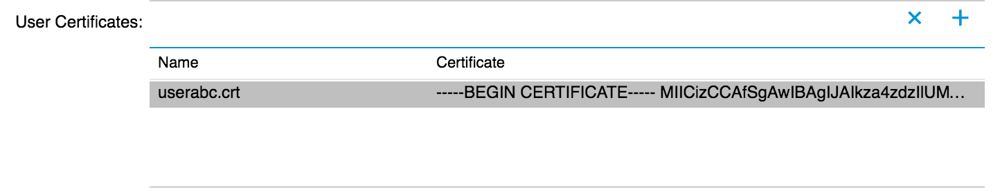

Building a Simple Tenant Configuration
======================================
The following section will walk you through the implementation of the
``tutorial.py`` file found in the ``/samples/`` directory.  This code
will create a minimal configuration that will configure 2 interfaces
on the fabric to be on the same network so that they can
communicate. This code can be executed with the following command from
within the ``/samples/`` directory::

   python tutorial.py

Configuration Object Definition
-------------------------------

`Imports`
~~~~~~~~~
The first part of the tutorial program consists of the ``import``
statement.  The ``acitoolkit`` module from the acitoolkit package is
imported.

.. code-block:: python

   from acitoolkit.acitoolkit import *

The ``acitoolkit`` module within the acitoolkit package provides
access to all of the acitoolkit configuration.

`Tenant Creation`
~~~~~~~~~~~~~~~~~

All of the configuration will be created within a single tenant named
``tutorial``.  This is done by creating an instance of the Tenant
class and passing it a string containing the tenant name.

.. code-block:: python

   tenant = Tenant('tutorial')

`Application Profile`
~~~~~~~~~~~~~~~~~~~~~

The Application Profile contains all of the Endpoint Groups
representing the application.  The next line of code creates the
application profile.  It does this by creating an instance of the
``AppProfile`` class and passing it a string containing the
Application Profile name and the ``Tenant`` object that this
``AppProfile`` will belong.

.. code-block:: python

   app = AppProfile('myapp', tenant)

Note that many of the objects within the acitoolkit are created in
this way, namely with a name and a parent object.  The parent object
must be an instance of this class's parent class according to the
acitoolkit object model.  The parent class of ``AppProfile`` is
``Tenant``.

`Endpoint Group`
~~~~~~~~~~~~~~~~

The Endpoint Group provides the policy based configuration for
Endpoints that are members of the Endpoint Group.  This is represented
by the ``EPG`` class.  In this case, we create an ``EPG`` with the
name `myepg` and pass the ``AppProfile`` that we created to be the
parent object.

.. code-block:: python

   epg = EPG('myepg', app)

`Context and Bridge Domain`
~~~~~~~~~~~~~~~~~~~~~~~~~~~

We also need an L3 namespace and L2 forwarding domain so we create the
``Context`` and ``BridgeDomain`` in the same manner as we did for the
previous objects.  For both of these classes, the parent class is
Tenant.

.. code-block:: python

   context = Context('myvrf', tenant)
   bd = BridgeDomain('mybd', tenant)

We then associate the ``BridgeDomain`` instance with the ``Context``
instance.  This indicates that this ``BridgeDomain`` exists within
this ``Context``.

.. code-block:: python

   bd.add_context(context)

The ``EPG`` is then associated with the ``BridgeDomain`` that we created.

.. code-block:: python

   epg.add_bd(bd)

Associating the tenant configuration with the network
-----------------------------------------------------

At this point, the tenant configuration is complete.  However, it is
not bound to the physical network yet so let's connect the EPG to 2
interfaces.

`Physical Interfaces`
~~~~~~~~~~~~~~~~~~~~~

First, we must create objects to represent the physical interfaces
using the ``Interface`` class.  Interface objects are named using
interface type, pod, node (switch), module (linecard), and port
names.  In this case, the interface type is ``'eth'`` for ethernet and
the interfaces are located in pod 1 on leaf switch 101 in module 1
within ports 15 and 16.

.. code-block:: python

   if1 = Interface('eth', '1', '101', '1', '15')
   if2 = Interface('eth', '1', '101', '1', '16')

`VLANs`
~~~~~~~

In order to allow multiple EPGs to connect to the same interface, the
ACI fabric uses network virtualization technologies such as VLAN,
VXLAN, and NVGRE to keep the traffic isolated.  In this case, we chose
to use VLAN since it is the most ubiquitous and we chose to use the
same encapsulation on both physical interfaces, namely VLAN 5.

The ``L2Interface class`` represents the virtual L2 network interface.  In
this case, this is the VLAN attached to a given physical interface.
This is the interface where L2 protocols (such as spanning tree in
traditional networks) run.  Link layer protocols such as LLDP run
directly on the physical interface independent of VLANs.

We create the ``L2Interface`` and pass a name ``vlan5_on_if1``, the encapsulation
technology ``vlan``, and the virtual network identifier ``5`` as part of the
contructor.

.. code-block:: python

   vlan5_on_if1 = L2Interface('vlan5_on_if1', 'vlan', '5')

We next associate this ``L2Interface`` to the desired physical
interface.

.. code-block:: python

   vlan5_on_if1.attach(if1)

And we repeat for the second physical interface.

.. code-block:: python

   vlan5_on_if2 = L2Interface('vlan5_on_if2', 'vlan', '5')
   vlan5_on_if2.attach(if2)

Now, we simply associate the ``EPG`` with the ``L2Interface`` objects
that we created.

.. code-block:: python

   epg.attach(vlan5_on_if1)
   epg.attach(vlan5_on_if2)

Deploying to the APIC
----------------------

At this point, the entire configuration is done and all that is left
is connecting to the APIC and deploying the configuration.

`APIC Login Credentials`
~~~~~~~~~~~~~~~~~~~~~~~~

The APIC login credentials are retrieved using an instance of the
``Credentials`` class. This class provides a convenient mechanism to
retrieve credentials and is used by a variety of toolkit applications.

The Credentials object is instantiated with a string describing the type
of credentials desired and a description string.

.. code-block:: python

    description = 'acitoolkit tutorial application'
    creds = Credentials('apic', description)

The command line is also extensible through the ``add_argument`` function.
This is the same ``add_argument`` function provided by the standard ``argparse``
python package. In this tutorial, we extend the command line options with a
delete flag so that we can clean up the configuration afterwards.

.. code-block:: python

    creds.add_argument('--delete', action='store_true',
                   help='Delete the configuration from the APIC')

Retrieving the credentials is done by calling the ``get`` function.

.. code-block:: python

        args = creds.get()

The ``apic`` set of credential variables consist of the ``username``, ``password``,
and ``URL`` of the APIC. The ``Credentials`` class allow the credentials to be
provided in a number of formats and is taken in the following priority order

* Command line options
* Configuration file called ``credentials.py``
* Environment variables
* Interactively querying the user

A search will be performed for each credential individually so that different
methods can be used at the same time.  For example, the username and URL can be
passed as Command Line Options and the password can be collected by querying
the user directly.  For this tutorial, we will query the user directly.

`APIC Login`
~~~~~~~~~~~~

Next, we log into the APIC.  This is done through the ``Session``
class.  We create an instance and pass it the login credentials,
namely the ``URL``, ``LOGIN``, and ``PASSWORD``.

.. code-block:: python

   session = Session(URL, LOGIN, PASSWORD)

We also initiate the actual login.

.. code-block:: python

   session.login()

Once the login is complete, we can now send our configuration to the
APIC. This is done by calling the ``Session`` object with the
``push_to_apic`` function that requires a URL and the JSON data to
send to the APIC.  All of the configuration for the application
topology is collected under the ``Tenant``.  In order to get the URL to
use and the JSON for our configuration, we simply call the ``Tenant``
instance with ``get_url`` and ``get_json`` respectively.

.. code-block:: python

   resp = session.push_to_apic(tenant.get_url(), data=tenant.get_json())

The ``push_to_apic`` call returns an object.  This object is an
instance of the ``Response`` class from the popular `requests
<http://docs.python-requests.org/en/latest/#>`_ library which provides
a rich set of return codes and status.  Here, we simply check that the
call was successful.

.. code-block:: python

   if resp.ok:
      print 'Success'

`APIC Login (Certificate based)`
~~~~~~~~~~~~~~~~~~~~~~~~~~~~~~~~

The APIC REST API also supports authentication using certificates.

Once setup, it is a more simple and secure form of authentication, with each request being
uniquely signed. Additionally, login timeout issues are removed. An important point to note
is that websockets (events) are not supported by the APIC when using certficate authentication,
so the corresponding acitoolkit functionality will be disabled.

As a prerequisite you must have created a private key and public certificate and attached the
certificate to the desired user using the APIC Web UI.

Creating a certificate session using the acitoolkit is simple:

1. Use OpenSSL to generate a X.509 certificate and private key. 

.. code-block:: bash

   openssl req -new -newkey rsa:1024 -days 36500 -nodes -x509 -keyout userabc.key -out userabc.crt -subj '/CN=User ABC/O=Cisco Systems/C=US'

2. Upload the generated certificate ``userabc.crt`` to the user via the APIC 

3. Certificate authentication has an extra dependency, not installed by default, which can be easily
installed using pip

.. code-block:: bash

   pip install pyopenssl

4. Create a certificate based authentication session

.. code-block:: python

   # Generic
   session = Session(URL, LOGIN, cert_name=CERT_NAME, key=KEY)

   # Example
   session = Session('https://1.1.1.1', 'userabc', cert_name='userabc.crt', key='userabc.key')

.. note:: If using the acitoolkit from the context of an APIC App Center app, make sure to pass the extra
   parameter ``appcenter_user=True``. App Center apps are provided a user that belongs to a different class
   of users.  The login and cert_name for App Center users are both in the form of ``vendor_appId``.  
   App Center users support certificate subsciptions through a special requestAppToken api. To use 
   subscriptions with an App Center user, you must explicitly call the ``login()`` method which acquires
   and maintains the App user token. Disable App center subscriptions by setting the parameter 
   ``subscription_enabled=False``.

You do not need to explicitly call the ``login()`` method when using certificate authentication.  

After this point, you can continue to use all of the acitoolkit methods to get and push configuration from the APIC securely and without logging in.

Displaying the JSON Configuration
---------------------------------

At this point, we're done !  The configuration has been sent to the
APIC.  Congratulations, you just programmed a datacenter fabric !  You
should be able to see your new tenant ``tutorial`` within the APIC GUI
with its new EPG and static path bindings.

The next few lines in the ``tutorial.py`` file simply print what was
sent to the APIC.  You can use this to manually edit the JSON if you
wish to access the richer API on the APIC that the acitoolkit does not
expose.

.. code-block:: python

   print 'Pushed the following JSON to the APIC'
   print 'URL:', tenant.get_url()
   print 'JSON:', tenant.get_json()

Removing the tenant configuration
---------------------------------

You might have noticed that we jumped over 2 lines of the tutorial code,
specifically the following lines.

.. code-block:: python

    if args.delete:
        tenant.mark_as_deleted()

The ``args.delete`` is set if the ``--delete`` command line option is given.
Calling the ``mark_as_deleted`` function will cause the tenant to be deleted
from the APIC when the configuration is pushed.  It should be noted that
deleting the tenant will cause all of the configuration for the tenant to be
deleted. This will allow us to run the tutorial and then run it again to delete
the configuration by executing the following commands.::

    python tutorial.py
    python tutorial.py --delete

The first command will push the configuration to the APIC and the second
command will delete the configuration leaving you where we started.
